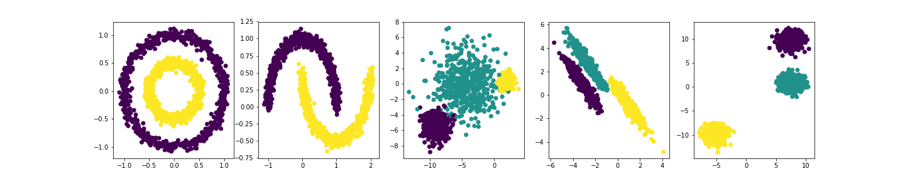
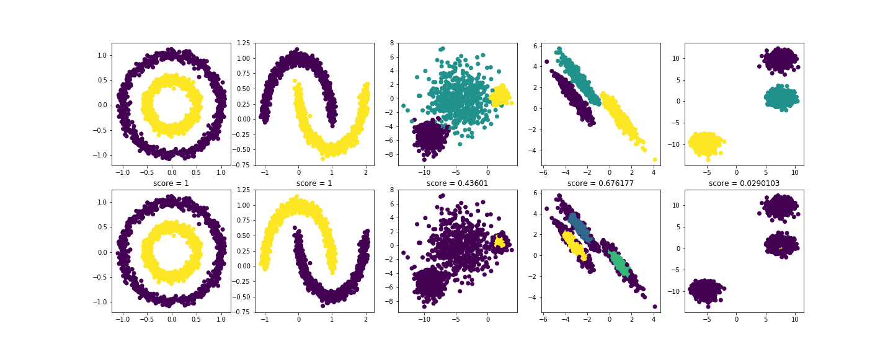

```python
>>> %pylab inline
Populating the interactive namespace from numpy and matplotlib
```

# pyannote.pipeline

## Installation
```bash
$ pip install pyannote.pipeline
```

## Tutorial

In this tutorial, we are going to tune hyper-parameters of a clustering pipeline.

We start by gathering a "training set" of 5 different clustering datasets.

```python
>>> # shamelessly stolen from https://scikit-learn.org/stable/auto_examples/cluster/plot_cluster_comparison.html
...
... import numpy as np
>>> from sklearn import datasets
...
>>> np.random.seed(0)
...
>>> n_samples = 1500
>>> noisy_circles = datasets.make_circles(n_samples=n_samples, factor=.5,
...                                       noise=.05)
>>> noisy_moons = datasets.make_moons(n_samples=n_samples, noise=.05)
>>> blobs = datasets.make_blobs(n_samples=n_samples, random_state=8)
...
>>> # Anisotropicly distributed data
... random_state = 170
>>> X, y = datasets.make_blobs(n_samples=n_samples, random_state=random_state)
>>> transformation = [[0.6, -0.6], [-0.4, 0.8]]
>>> X_aniso = np.dot(X, transformation)
>>> aniso = (X_aniso, y)
...
>>> # blobs with varied variances
... varied = datasets.make_blobs(n_samples=n_samples,
...                              cluster_std=[1.0, 2.5, 0.5],
...                              random_state=random_state)
...
>>> datasets = [noisy_circles, noisy_moons, varied, aniso, blobs]
...
>>> figsize(20, 4)
>>> for d, dataset in enumerate(datasets):
...     X, y = dataset
...     subplot(1, len(datasets), d + 1)
...     scatter(X[:, 0], X[:, 1], c=y)
>>> savefig('README_datasets.png')
<Figure size 1440x288 with 5 Axes>
```




Then, we define the clustering pipeline (including its set of hyper-parameters and the objective function).

```python
>>> from pyannote.pipeline import Pipeline
>>> from pyannote.pipeline.parameter import Uniform
>>> from pyannote.pipeline.parameter import Integer
>>> from sklearn.cluster import DBSCAN
>>> from sklearn.metrics import v_measure_score
...
>>> # a pipeline should inherit from `pyannote.pipeline.Pipeline`
... class SimplePipeline(Pipeline):
...
...     # this pipeline has two hyper-parameters.
...     # `eps` follows a uniform distribution between 0 and 10
...     # `min_samples` is a random integer between 1 and 20
...     def __init__(self):
...         super().__init__()
...         self.eps = Uniform(0, 10)
...         self.min_samples = Integer(1, 20)
...
...     # `initialize` should be used to setup the pipeline. it
...     # is called every time a new set of hyper-parameters is
...     # tested.
...     def initialize(self):
...         # this pipeline relies on scikit-learn DBSCAN.
...         self._dbscan = DBSCAN(eps=self.eps,
...                               min_samples=self.min_samples)
...
...     # this is where the pipeline is applied to a dataset
...     def __call__(self, dataset):
...         X = dataset[0]
...         y_pred = self._dbscan.fit_predict(X)
...         return y_pred
...
...     # this is the loss we are trying to minimize
...     def loss(self, dataset, y_pred):
...         # we rely on sklearn v_measure_score
...         y_true = dataset[1]
...         return 1. - v_measure_score(y_true, y_pred)
...
>>> pipeline = SimplePipeline()
```

This is where the hyper-parameter optimization actually happens.

```python
>>> !rm dbscan.db
```

```python
>>> # we initialize an optimizer (that store its trials in SQLite file dbscan.db)
... from pyannote.pipeline import Optimizer
>>> optimizer = Optimizer(pipeline, db=Path('dbscan.db'))
```

```python
>>> # we run 100 optimization iterations and display the best set of hyper-parameters
... optimizer.tune(datasets, n_iterations=100)
>>> optimizer.best_params
{'eps': 0.1912781975831715, 'min_samples': 18}
```

We then compare expected (upper row) and actual (lower row) clustering results with the best set of hyper-parameters

```python
>>> best_pipeline = optimizer.best_pipeline
>>> # equivalent to
... # best_pipeline = pipeline.instantiate(optimizer.best_params)
...
... figsize(20, 8)
>>> for d, dataset in enumerate(datasets):
...     X, y_true = dataset
...     y_pred = best_pipeline(dataset)
...     subplot(2, len(datasets), d + 1)
...     scatter(X[:, 0], X[:, 1], c=y_true)
...     subplot(2, len(datasets), d + 1 + len(datasets))
...     scatter(X[:, 0], X[:, 1], c=y_pred)
...     title(f'score = {v_measure_score(y_true, y_pred):g}')
>>> savefig('README_results.png')
<Figure size 1440x576 with 10 Axes>
```




## Documentation

`pyannote.pipeline` can do much more than that (including composing pipelines and freezing hyper-parameters).
See `pyannote.audio.pipeline` for advanced examples.
